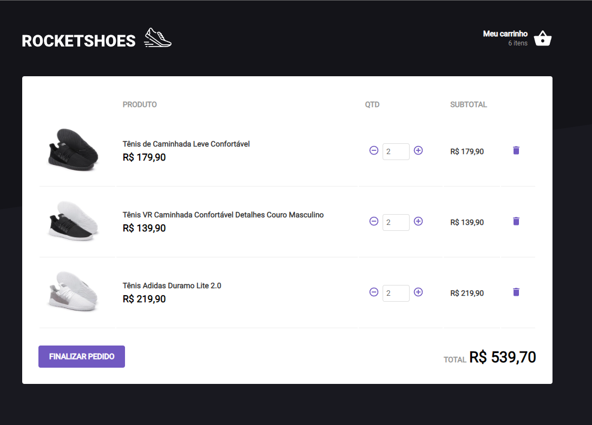

# RocketShoes - Implementando um Hook de Carrinho de Compras

Desafio 03 da Trilha ReactJS do Ignite, foi realizada a implementação de um hook de carrinho de compras para prática dos conhecimentos adquiridos no Capítulo 02.

---

Feito com 💜 por Lohana T. Leopoldo

